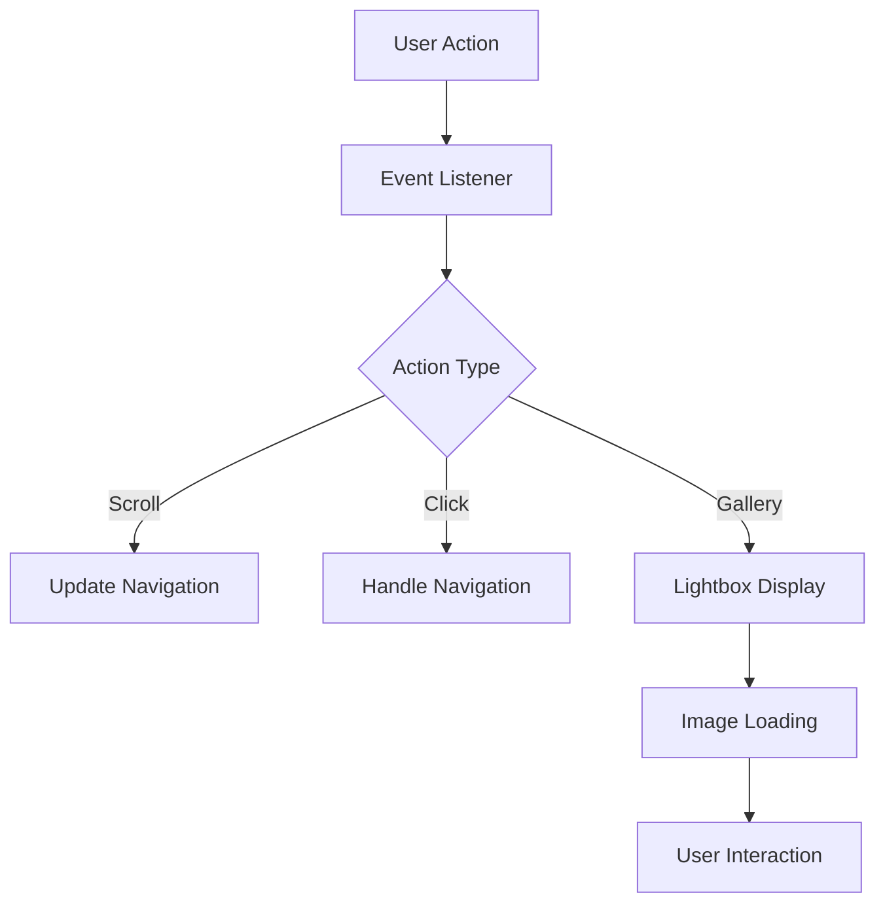

# 🌟 Modern Website with Interactive Gallery & Smart Navigation


> Create stunning visual experiences with our modern, responsive website template featuring a beautiful lightbox gallery and intelligent navigation system.

## ✨ Features

- **Smart Navigation** 
  - Scroll-aware header that adapts to user behavior
  - Smooth transitions and animations
  - Collapsible mobile-friendly menu
  
- **Interactive Gallery**
  - Elegant lightbox implementation
  - Touch-friendly controls
  - Responsive image grid
  
- **Modern Architecture**
  - Clean and organized file structure
  - Separation of concerns
  - Performance-optimized assets

## 🎯 Quick Start

### Prerequisites

- A modern web browser
- Basic understanding of HTML/CSS/JavaScript
- A code editor (VS Code recommended)

### Installation

1. Clone this repository:
   ```bash
   git clone https://github.com/yourusername/modern-website.git
   cd modern-website
   ```

2. Open `index.html` in your browser to start exploring!

## 📁 Project Structure

```
root/
├── 📄 index.html          # Main landing page
├── 📄 about.html          # About section
├── 📄 contact.html        # Contact information
├── 📄 gallery.html        # Image gallery
├── 📄 product.html        # Product showcase
├── 📄 404.html           # Custom error page
├── css/                  # Styling files
│   ├── style.css         # Main styles
│   ├── responsive.css    # Responsive designs
│   └── lightbox.css      # Gallery styles
└── js/                   # JavaScript files
    ├── main.js           # Core functionality
    └── lightbox.js       # Gallery interactions
```

## 🚀 Usage Guide

### For Developers

1. **Customizing Styles**
   ```css
   /* css/style.css */
   :root {
     --primary-color: #your-color;
     --secondary-color: #your-color;
   }
   ```

2. **Adding Gallery Images**
   ```html
   <div class="gallery-item">
     
   </div>
   ```

### For Content Managers

1. Navigate to the relevant HTML file
2. Locate the content section marked with comments
3. Update text and images as needed
4. Test changes across different devices

## 🔧 Troubleshooting

### Common Issues & Solutions

| Issue | Solution |
|-------|----------|
| Images not loading | Check file paths and permissions |
| Navigation not responsive | Verify JavaScript is enabled |
| Lightbox not working | Ensure all dependencies are loaded |

### Debug Mode

Enable debug logging by adding `?debug=true` to the URL:
```javascript
// Example debug output
[Nav] Scroll position: 150px
[Lightbox] Loading image: gallery/image1.jpg
```

## ⚡ Performance Tips

1. **Image Optimization**
   - Use WebP format where possible
   - Implement lazy loading
   - Optimize image dimensions

2. **Code Minification**
   ```bash
   # Using npm
   npm install -g minifier
   minify css/style.css > css/style.min.css
   ```

3. **Caching Strategy**
   - Implement browser caching
   - Use service workers for offline support

## 🔄 Data Flow




---

<div align="center">
  <strong>Made with passion by developers, for developers</strong>
  <br>
  <small>© 2025 Your Organization. All rights reserved.</small>
</div>
